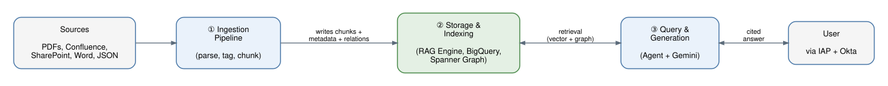
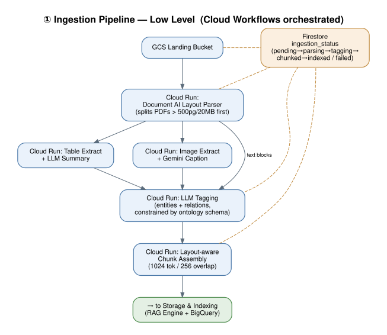
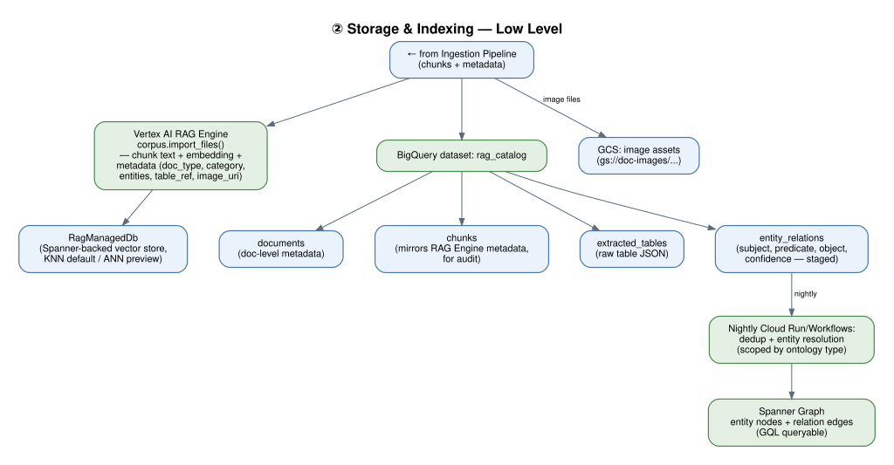
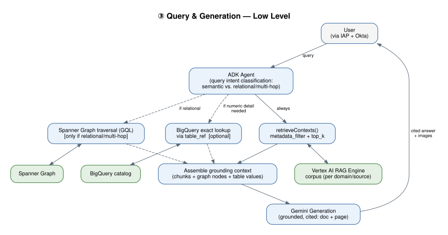

# Enterprise Multimodal RAG Platform — TDD
## (Vertex AI RAG Engine Implementation)

## 1. Architecture Summary

### High-Level View



Four zones: **Sources** feed the **Ingestion Pipeline**, which writes chunks, metadata, and staged entity relations into **Storage & Indexing**; the **Query & Generation** layer retrieves from there (vector + graph) and returns cited answers to the user. Each zone is broken out in detail below.

### ① Ingestion Pipeline — Low Level



### ② Storage & Indexing — Low Level



### ③ Query & Generation — Low Level



**Text flow (for reference alongside the diagrams above):**

```
Sources (GCS landing: PDFs, Confluence export, SharePoint, JSON)
   → Cloud Workflows (orchestration)
        → Cloud Run job: Document AI layout parser (parse)
        → Cloud Run job: table extraction + LLM summary → BigQuery raw tables
        → Cloud Run job: image extraction + Gemini captioning → GCS images
        → Cloud Run job: LLM tagging (entities, doc type, category)
        → Cloud Run job: layout-aware chunk assembly
        → Vertex AI RAG Engine: corpus.import_files (chunks + metadata)
        → BigQuery: catalog write (audit, table refs, image refs, tags, entity relations)
   → Firestore: per-document status tracking throughout

Nightly graph promotion job:
BigQuery (entity_relations, staged) → dedup/merge → Spanner Graph (nodes + edges)

Query path:
ADK Agent → RAG Engine retrieveContexts (metadata_filter + top_k)
          → (optional) Spanner Graph traversal for multi-hop/relational intent
          → (optional) BigQuery exact lookup via table_ref
          → Gemini generation (grounded) → cited answer to user
```

## 2. Why Vertex AI RAG Engine (vs. Vertex AI Search)

- Native Python SDK for corpus creation, file import, and retrieval (`vertexai.rag`) — tighter integration with the ADK agent code path than Search's Discovery Engine API
- Built-in **Document AI layout parser integration** at import time for layout-aware chunking of PDFs with tables/images
- Native **metadata_filter** expressions on `retrieveContexts` (e.g. `doc_type == "spec" && year == 2025`) for tight, structured filtering
- Choice of vector backend: default **RagManagedDb** (Spanner-based, no provisioning) with KNN (exact, best under ~10K files) or ANN (preview, for larger corpora); or bring your own — Vertex AI Vector Search, Feature Store, Pinecone, Weaviate — if future scale or existing infra requires it
- Trade-off vs. Vertex AI Search: RAG Engine gives more programmatic control over the ingestion/chunking pipeline and finer metadata filtering, at the cost of more custom orchestration (Search's Agent Search UI/console tooling is more turnkey)

## 3. Component Design

### 3.1 Ingestion Orchestration
- **Cloud Workflows** defines the DAG: parse → table/image processing → tagging → chunk → import → catalog write
- **Cloud Run jobs** (one per stage, containerized, horizontally scalable) do the actual processing
- **Firestore** collection `ingestion_status`, keyed by `doc_id`, fields: `status`, `stage`, `last_updated`, `error_detail`, `retry_count`
- Failure handling: Cloud Workflows retry policy per step (exponential backoff, max 3 attempts) before marking `failed` in Firestore for manual/automated re-queue

### 3.2 Parsing — Document AI Layout Parser
- Invoked either directly via Document AI API (standalone) or via RAG Engine's built-in layout parser option at `import_files` time, selectable per corpus
- Recommended: use standalone Document AI first (Stage 1 Cloud Run job) so table/image extraction (§3.3, §3.4) and tagging (§3.5) can run **before** chunks are imported to RAG Engine — this gives full control over metadata attached to each chunk, which is not achievable if you rely solely on RAG Engine's built-in parser at import time
- Constraint: 20 MB/file, 500 pages/PDF — Cloud Run job splits oversized PDFs by section prior to parsing

### 3.3 Table Handling
- Raw structured table → written to BigQuery table `extracted_tables` (columns: `table_id`, `doc_id`, `page`, `raw_json`, `ingested_at`)
- LLM-generated natural-language summary of the table → becomes chunk text, tagged with `content_type = "table_summary"` and `table_ref = table_id` metadata field

### 3.4 Image Handling
- Image crop extracted → stored in GCS (`gs://doc-images/{doc_id}/{image_id}.png`)
- Gemini multimodal captioning → caption text becomes chunk text, tagged `content_type = "image_caption"`, `image_uri` metadata field for UI rendering

### 3.5 Tagging
- LLM pass over each text block/table summary/image caption extracts: entities, doc_type, category, source, date
- Metadata schema (applied uniformly, becomes RAG Engine chunk metadata AND BigQuery catalog row):

```json
{
  "doc_id": "string",
  "chunk_id": "string",
  "page": "int",
  "content_type": "text | table_summary | image_caption",
  "doc_type": "string",
  "category": "string",
  "entities": ["string"],
  "source": "string",
  "date": "YYYY-MM-DD",
  "table_ref": "string | null",
  "image_uri": "string | null"
}
```

### 3.6 Chunking
- Layout-aware chunking respecting Document AI's block boundaries (headings/paragraphs/lists never split mid-unit)
- Baseline: 1024 token chunks, 256 overlap; table summaries and image captions kept as standalone single chunks (not merged with surrounding prose)

### 3.7 Vertex AI RAG Engine Corpus Design
- **Corpus segmentation:** given the one-corpus-per-generation-request limit, segment corpora by logical domain/source (e.g., `corpus-product-specs`, `corpus-confluence`) rather than one giant corpus — the ADK agent selects/routes to the relevant corpus per query, or performs sequential retrieval across corpora if a query needs cross-domain grounding
- **Vector DB:** start with default **RagManagedDb** (KNN) for POC/Phase 1 — no provisioning overhead; re-evaluate ANN or Vertex AI Vector Search if a single corpus exceeds ~10K files or latency degrades
- **Embedding model:** select and lock at corpus creation (e.g., `text-embedding-005` or current Gemini embedding model) — document this decision, since changing later requires full corpus recreation and re-import
- **Import:** `rag.import_files()` called per Cloud Run job with chunk text + metadata dict per file/chunk

### 3.8 BigQuery Catalog (Governance Layer)
- Dataset `rag_catalog` with tables: `documents` (doc-level metadata), `chunks` (chunk-level metadata mirroring RAG Engine's, for audit/reporting), `extracted_tables` (§3.3), `ingestion_audit` (pipeline run history)
- Not on the query serving path — used for admin dashboards, compliance, and as the future source for a graph-relationship export (Phase 3)

### 3.9 Query / Retrieval Path
- ADK agent calls `retrieveContexts` against the relevant corpus/corpora with `top_k` and `metadata_filter` (e.g., `doc_type == "spec" && category == "hardware"`)
- Returned contexts include `table_ref`/`image_uri` metadata; agent may issue a follow-up BigQuery lookup via `table_ref` for exact numeric values rather than trusting the LLM's paraphrase
- Gemini generation step assembles retrieved contexts into the grounding prompt, returns cited answer (source doc + page); UI renders linked images via `image_uri`

### 3.10 Security
- IAP + Okta in front of the agent-facing application
- Per-service IAM: Cloud Run jobs use dedicated service accounts scoped to only the GCS/BigQuery/RAG Engine resources they need
- BigQuery catalog access restricted to admin/analytics roles, separate from the query-serving path's service account

### 3.11 IaC (Terraform)
- Modules: GCS buckets (landing, images), Cloud Workflows definition, Cloud Run job definitions, Firestore database/collection setup, BigQuery dataset/tables, RAG Engine corpus provisioning (via `google_vertex_ai_rag_...` resources or a deploy-time Python/CLI step if Terraform support lags), IAM bindings
- Two paths per original design: manual console/CLI steps documented for quick POC, full Terraform apply for repeatable environments (dev/staging/prod)

### 3.12 Knowledge Graph Layer

**Purpose:** Enable multi-hop and relationship-aware retrieval that flat chunk similarity search can't do — e.g. "what else references the same entity as this document" or "what depends on X."

**Ontology (controlled schema):** Before extraction runs at scale, define a small, curated schema rather than letting the LLM invent labels freely:
- **Entity types (classes):** e.g. `Product`, `Component`, `Process`, `Organization`, `Location`, `Document` — every extracted entity is typed, not just named
- **Relationship types (predicates):** a fixed, controlled vocabulary — e.g. `depends_on`, `is_part_of`, `supports`, `located_in`, `references` — instead of whatever phrasing the extraction prompt happens to produce
- **Basic type constraints:** which entity types a given predicate may connect (e.g. `depends_on` only between two `Component` entities), catching nonsensical edges before they reach the graph
- Maintained as a versioned config file (YAML/JSON) in the pipeline repo, reviewed by domain SMEs during Phase 3 planning — not a separate ontology-management tool or formal OWL/RDF model, since automated logical inference isn't a requirement here
- Fed directly into the Stage 4 extraction prompt as a closed-vocabulary instruction ("classify this entity as one of: [...]"; "select the relation from: [...]"), so extraction is constrained at the source rather than corrected after the fact

**Entity/relation extraction:** Extends the existing Stage 4 tagging pass (§3.5) rather than adding a separate pipeline — the same LLM call that extracts entities per chunk also extracts relation triples (subject–predicate–object) found in that chunk's text, constrained to the ontology's entity/relation types above, reusing content already being processed.

**Staging:** Triples are written to a new BigQuery table `entity_relations` (`subject`, `predicate`, `object`, `doc_id`, `chunk_id`, `confidence`, `extracted_at`) as part of the same ingestion pipeline run that writes the rest of the catalog (§3.8).

**Graph store:** **Spanner Graph** is recommended as the primary backend — it shares underlying infrastructure with RagManagedDb (RAG Engine's default vector store), avoiding a second database technology to operate, and supports GQL for traversal queries. A scheduled (e.g. nightly) Cloud Run/Workflows job promotes new/changed rows from `entity_relations` into Spanner Graph nodes and edges.

**Entity resolution:** Because entities are extracted per-chunk independently, the promotion job must deduplicate/merge nodes before they're considered canonical — normalized string match plus an embedding-similarity threshold, scoped within the same entity type from the ontology (e.g., two `Component` entities named "Product X" and "product x" should resolve to one node; a `Component` and a `Location` never merge regardless of name similarity). Unresolved/low-confidence merges are flagged for manual review rather than auto-merged.

**Retrieval integration:** For queries the agent classifies as relational/multi-hop, it queries Spanner Graph directly for connected entities/documents, then fetches the corresponding chunk text from RAG Engine (matched via `doc_id`/`chunk_id` metadata) to ground the answer — graph traversal supplements vector retrieval rather than replacing it. For purely semantic queries, the agent skips the graph step entirely to avoid added latency.

**Why not build the graph directly in RAG Engine:** RAG Engine has no native graph/entity-relationship capability — it's a chunk-and-vector retrieval engine. The graph is therefore a genuinely separate layer that reads its inputs from the same tagging pass but is stored and queried independently.

### 3.13 Monitoring
- Cloud Monitoring dashboards: ingestion pipeline success/failure rate, per-stage latency, query P95 latency, RAG Engine corpus size/growth
- Eval scores (see §4) surfaced on the same dashboard for ongoing quality tracking alongside operational metrics

## 4. Evaluation Strategy

### 4.1 Objectives
- Ensure retrieval is precise (returns the right chunks) and generation is grounded (the answer is actually supported by retrieved context, with correct citations)
- Catch regressions before they reach prod whenever corpus content, chunking config, tagging prompts, or the generation prompt changes
- Once the graph layer (§3.12) is live, separately validate that graph-assisted retrieval is actually improving answers on multi-hop questions, not just adding latency

### 4.2 Golden Dataset Construction
- Sample representative questions across each corpus/domain, with target coverage per `doc_type`/`category` combination so no segment of the corpus is untested
- For each question, capture: expected answer (or answer criteria), expected source doc(s)/page(s), and expected chunk IDs where feasible
- Include a dedicated subset of multi-hop questions to exercise graph-assisted retrieval once built
- Include negative/adversarial cases: questions with no good answer in the corpus (correct behavior is "I don't know," not a hallucinated answer) and ambiguous questions
- Version-control the golden set (BigQuery table or JSONL in the pipeline repo) so eval runs are reproducible and changes to the dataset itself go through review

### 4.3 Metrics
| Category | Metric | What it catches |
|---|---|---|
| Retrieval | Context precision | Irrelevant chunks polluting the retrieved set |
| Retrieval | Context recall | The chunk that actually contains the answer wasn't retrieved |
| Generation | Groundedness | Answer contains claims not supported by retrieved context |
| Generation | Citation accuracy | Cited doc/page doesn't actually contain the claimed information |
| Generation | Answer relevance | Answer doesn't address the question asked |
| Operational | Latency (P50/P95) | End-to-end retrieval + generation time |
| Graph (Phase 3) | Relation extraction precision | Sampled manual review of extracted entity/relation triples |
| Graph (Phase 3) | Entity resolution accuracy | Merged nodes that aren't actually the same entity |
| Graph (Phase 3) | Graph contribution rate | % of multi-hop questions where enabling graph retrieval measurably improved groundedness/completeness vs. vector-only |

### 4.4 Eval Pipeline / Steps
1. **Offline eval (pre-merge / pre-deploy):** Run the golden query set against a staging corpus through an eval harness — Vertex AI's Gen AI evaluation service for standard groundedness/relevance scoring, plus a custom scorer for RAG Engine-specific checks (context precision/recall against actual `retrieveContexts` output, citation-to-source verification). Triggered in CI whenever ingestion pipeline code, tagging prompts, chunking config, or corpus config changes.
2. **Threshold gating:** Define minimum acceptable scores per metric (e.g., groundedness ≥ 0.9, citation accuracy ≥ 0.95). CI blocks promotion to prod if any threshold isn't met.
3. **Regression comparison:** Compare the new run's scores against the last known-good baseline, not just an absolute threshold — flag statistically significant drops even when still above the minimum.
4. **Sampled human review:** SMEs manually review a rotating sample (e.g., 5–10%) of eval runs, focused on groundedness and citation accuracy, since LLM-as-judge scoring itself needs periodic calibration against human judgment.
5. **Production shadow eval:** Periodically replay a sample of real, anonymized production queries through the same harness to catch drift the static golden set might miss.
6. **Graph eval (Phase 3):** Run the multi-hop subset of the golden set with graph retrieval enabled vs. disabled and compare scores — confirms the graph is adding real value before it's trusted in the default query path.
7. **Post-deploy monitoring:** Continuously score a low-volume sample of live queries (plus user thumbs up/down if available) and feed results into the same dashboard as ingestion/latency metrics (§3.13), for ongoing quality tracking rather than a one-time gate.

### 4.5 Ownership & Cadence
- CI-triggered eval: automatic and blocking on every pipeline/prompt/corpus-config change
- Full golden set + human review sample: run weekly regardless of code changes, to catch corpus-drift regressions (e.g., stale documents, tagging quality decay)
- Thresholds and golden dataset coverage: reviewed quarterly as the corpus and user base grow

## 5. Key Risks & Mitigations

| Risk | Mitigation |
|---|---|
| One-corpus-per-request limit fragments cross-domain queries | Domain-based corpus segmentation + agent-side multi-corpus sequential retrieval when needed |
| Embedding model lock-in at corpus creation | Document model choice decision explicitly; budget for re-import if a materially better model is released |
| RAG Engine built-in parser vs. custom pipeline duplicating work | Standardize on standalone Document AI + custom augmentation (§3.2) as the single source of chunks; disable RAG Engine's own parser at import to avoid double-processing |
| BigQuery catalog drifting out of sync with RAG Engine index | Single ingestion pipeline writes both in the same transaction/step (§3.6–3.8); Firestore status only marks `indexed` after both writes succeed |
| Large PDFs exceeding 500-page/20MB limits | Pre-split by section in Stage 1 Cloud Run job before Document AI call |
| Duplicate/near-duplicate entity nodes fragment the graph | Dedup/merge step in the nightly promotion job (§3.12); low-confidence merges flagged for manual review rather than auto-merged |
| Graph traversal adds latency to queries that don't need it | Agent classifies query intent first; graph step only invoked for relational/multi-hop queries (§3.12) |
| Ontology schema doesn't cover a real-world entity/relationship type, causing extraction to force a poor fit | Schema versioned and reviewed on a regular cadence with domain SMEs; extraction prompt allows a small "uncategorized" fallback type flagged for review rather than forcing a bad match |

## 6. Open Questions for Stakeholder Review

- Final corpus segmentation boundaries (by source system, by business domain, or hybrid)?
- ANN vs. KNN threshold — at what corpus size do we proactively switch?
- Entity resolution confidence threshold for auto-merge vs. manual review in the graph promotion job?
- How much of Phase 3 (graph layer) ships before Phase 2 (GA) — can they run in parallel given they share the tagging pass?
- Who owns golden dataset curation and SME review capacity (§4.4) on an ongoing basis?
- Who owns defining and evolving the ontology schema (§3.12) — a one-time domain workshop, or an ongoing review board as new document types are onboarded?
